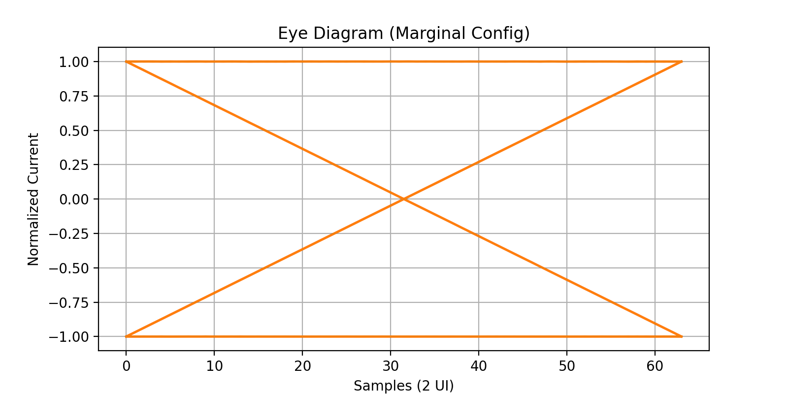
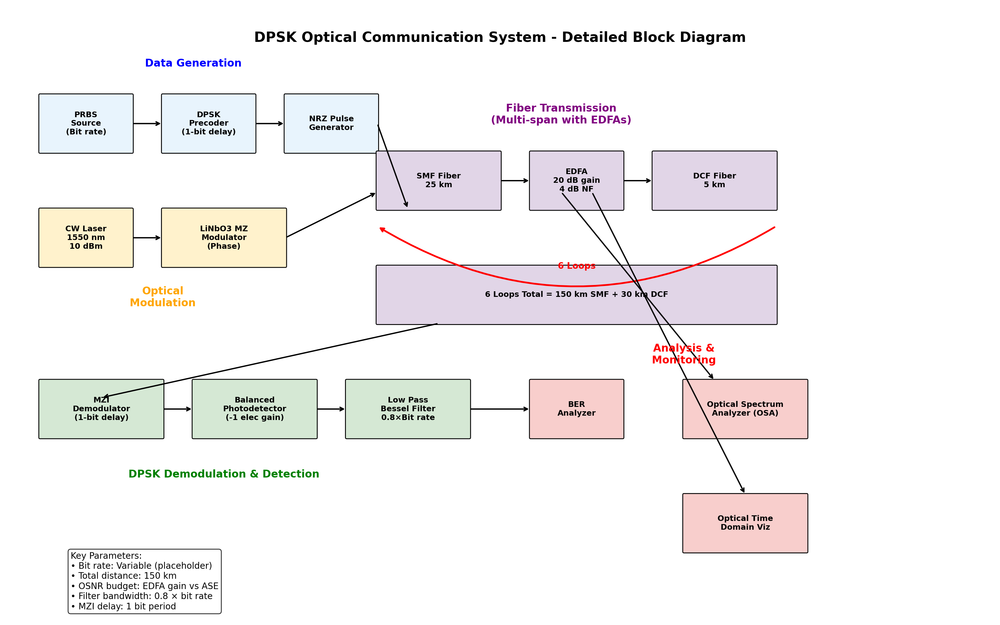
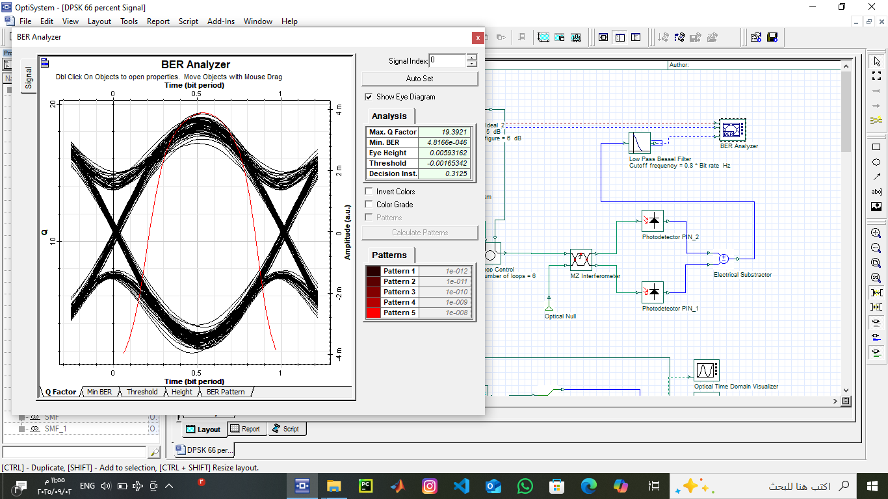

# Optical DPSK Communication System: Design, Simulation, and Analysis 📡🔦

This project focuses on the design and performance analysis of an **Optical Differential Phase Shift Keying (DPSK)** communication system using a **66% Return-to-Zero (RZ)** signal format. It explores the advantages of phase-based modulation in enhancing receiver sensitivity and nonlinear tolerance in high-speed fiber-optic networks.

---

## 🚀 Project Highlights
- **Modulation Excellence:** Implementation of RZ-DPSK for superior spectral efficiency.
- **System Analysis:** Evaluating performance over long-haul fiber spans (SMF & DCF).
- **Optimization:** Balancing filter bandwidths and launch powers to minimize Bit Error Rate (BER).

---

## 🛠 System Design & Architecture
The system was modeled and simulated using **OptiSystem**, featuring a complete transmitter, optical fiber link with dispersion compensation, and a balanced receiver.

### 📐 Optical Circuit Design
The following diagram shows the integrated components of the DPSK transmitter and receiver chain:

### ⚙️ Simulation Parameters
A rigorous selection of parameters was implemented to ensure realistic fiber-optic transmission modeling:

---

## 📊 Performance Results
The system's efficiency was verified through eye diagrams and BER analysis, demonstrating high tolerance to dispersion and noise.

### Eye Diagram Analysis
The clarity of the received signal was analyzed to ensure minimal Inter-Symbol Interference (ISI):

### Q-Factor & BER Results
The balanced detection method significantly improved the signal-to-noise ratio:

---

## 📁 Repository Structure
- `📂 Reports/`: Detailed IEEE-format project report and technical documentation.
- `📂 Presentation/`: Slides summarizing the design, simulation, and results.
- `📂 Simulation/`: Design files (OptiSystem/MATLAB) for the communication link.
- `📂 Media/`: System diagrams, parameters tables, and performance plots.

---

## 📚 References
1. **Al-Dhubaibi, T. A., & Abbas, D.** (2025). *Optical DPSK Communication System: Design, Simulation, and Analysis*. Faculty of Engineering, Sana'a University.
2. Agrawal, G. P. (2010). *Fiber-Optic Communication Systems*. 4th Edition.

---

## 👨‍🔬 About the Author
**Theyazan A. Al-Dhubaibi** *Telecommunications & Network Engineer | AI & Cybersecurity Researcher* Founder of **Syncolars for Academic Studies & Research**. Specialized in next-generation optical and wireless infrastructure.

---
*"Pushing the limits of data transmission through optical innovation."*
